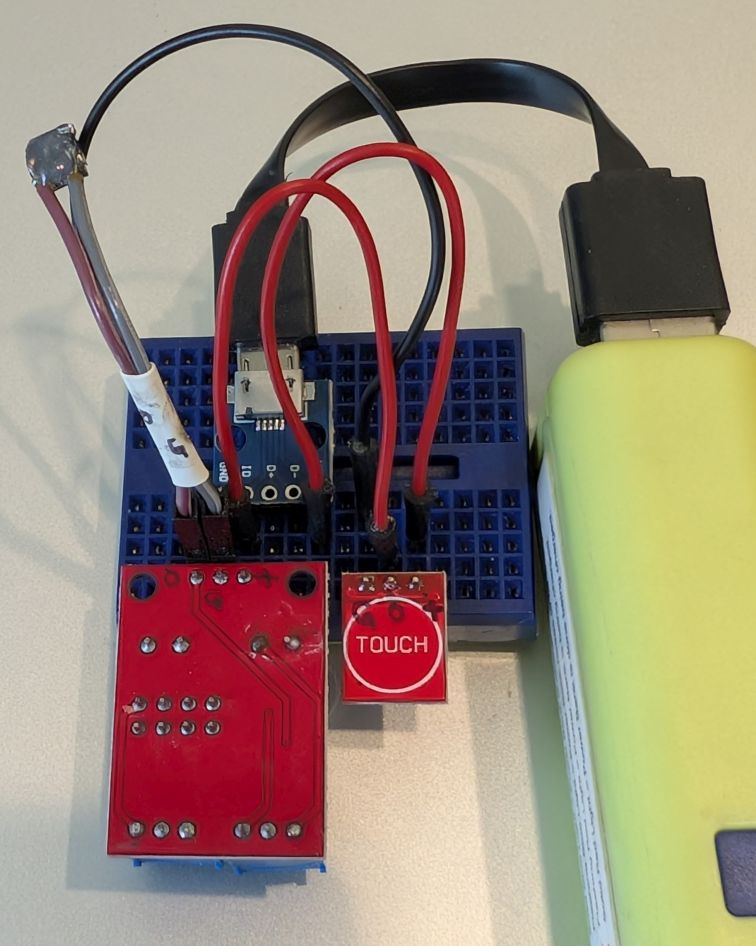
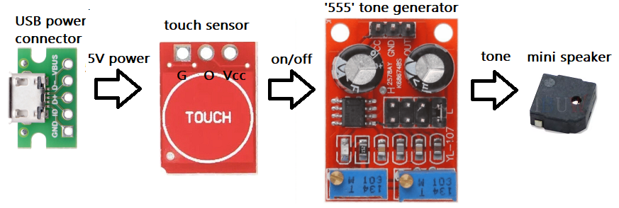
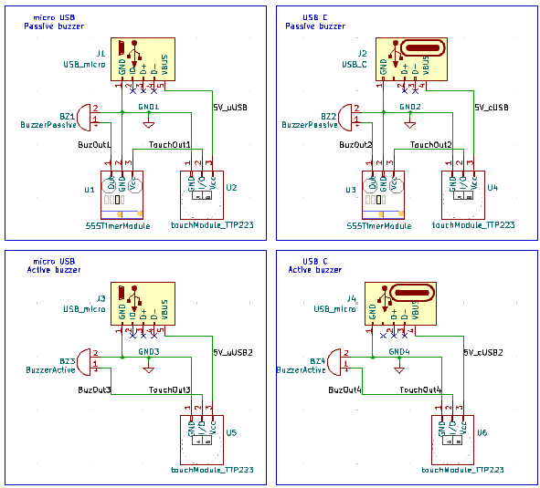
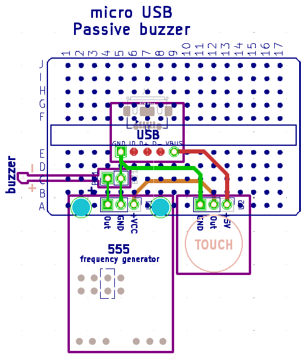
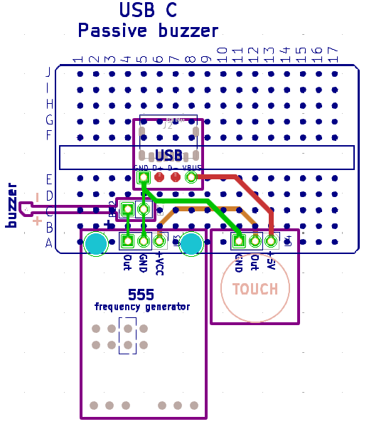
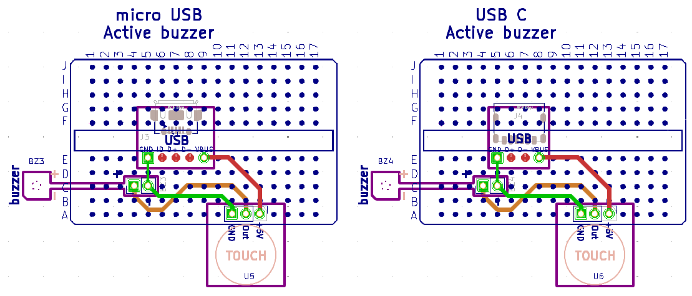

## Breadboard Keyer Demo for [ARROW](https://w8rp.org/) Field Day
### A Morse Code Practice Keyer Kit

### See the assembly documentation [here](doc/breadboardKeyer.odt).

  

#### Block diagram:
  

a) Power comes from an external USB power bank.  
b) This 5 volts powers the touch sensor-- it doesn’t directly power anything else!  
c) When the sensor is touched, its output turns on the tone generator.  
d) The tone generator output drives the mini speaker.  
Note:  a simplified variant may be built with an [active buzzer](https://www.aliexpress.us/item/3256809353431502.html) instead of the speaker; the '555' tone generator is then not used.

#### [Schematic](./breadboardKeyer.kicad_pro):  
There are four variations:
- micro USB breakout connector with passive speaker  
- USB C breakout connector with passive speaker  
- micro USB breakout connector with active buzzer
- USB C breakout connector with active buzzer

#### [Breadboard Layouts](./breadboardKeyer.kicad_pro):  
Passive buzzer/speaker with micro USB connector  

#### Passive buzzer/speaker with USB C connector  

#### Active buzzer with micro USB and USB C connectors  

### Bill-of-materials  
#### Summary for All Variants:  

| Reference | P/N |  Description | Link |  
| --- | --- | --- | ---- |  
| †qty ~3-5 | ??? | M-to-M breadboard jumper wires, 5-10cm | [AliExpress](https://www.aliexpress.us/item/3256809296261235.html) |  
| ‡qty 2 | ??? | M-to-M breadboard jumper ribbon, 5-10cm | [Amazon](https://www.amazon.com/dp/B01BV3Z342) |  
| qty 1 | ??? | 170-point mini breadboard | [Amazon](https://www.amazon.com/dp/B0DBDTBDS5?th=1) |  
| qty 1 | ??? | 3x3x3 inch craft paper box | [Amazon](https://www.amazon.com/dp/B0FXFWWB6K?th=1) |  
| qty 1 | 8376 |  ⃰ ⃰ Avery 2x3.5 card stock | e.g., [Amazon](https://www.amazon.com/Avery-Ink-Jet-Printer-Business-28371/dp/B00004Z5DG) |  
| qty ?? | ??? | ⃰heatshrink tubing as needed | [Amazon](https://www.amazon.com/dp/B0GGGY2HFJ) |  
| qty ?? | ??? | ⃰low-temp hot-glue sticks as needed | [Amazon](https://www.amazon.com/Surebonder-Low-Temp-Delicate-Materials-Balloons/dp/B003SBUAAI) |  
| J1, J3 | ??? | micro USB receptacle breakout | [Amazon](https://www.amazon.com/dp/B09XMQRNDL) |  
| J2, J4 | ??? | USB C receptacle breakout | [AliExpress](https://www.aliexpress.us/item/3256804610646385.html) |  
| BZ1, BZ2 | 5020 | 5x5x2mm speaker | [AliExpress](https://www.aliexpress.us/item/3256804070323228.html) |  
| BZ1, BZ2 | ??? | (alternate) PC speaker | [AliExpress](https://www.aliexpress.us/item/3256809886938359.html) |  
| BZ3, BZ4 | 9650 | 9.6x9.6x5mm 3V active buzzer | [AliExpress](https://www.aliexpress.us/item/3256809353431502.html) |  
| U2, U4, U5, U6 | TTP223 | TTP223 touch module | [AliExpress](https://www.aliexpress.us/item/2255800354323887.html) |  
| U1, U3 | NE555 | NE555 module | [AliExpress](https://www.aliexpress.us/item/3256806859546992.html) |  

† Jumper wires used for on-breadboard connections.
  Cut in half, these are soldered to the 5020 or 9650 speakers/buzzers  
‡ Ribbon jumper wires are plugged into the PC speakers/buzzers  
⃰ Use heatshrink to prevent separation of ribbon jumper wires, if needed.  Use hot glue to fill on top of speaker solder joints to prevent wire breakage.  
 ⃰ ⃰ Place card with github link to this page inside the kit's paper box.  Template is [here](doc/businessCards_bbkeyerKit_Avery8376.odt)

You will also need a USB power bank and appropriate USB cable-- not included in the kit.

#### Common to All Variants:  

| Quantity | P/N |  Description | Link |  
| --- | --- | --- | ---- |  
| †qty ~3-5 | ??? | M-to-M breadboard jumper wires, 5-10cm | [AliExpress](https://www.aliexpress.us/item/3256809296261235.html) |  
| ‡qty 2 | ??? | M-to-M breadboard jumper ribbon, 5-10cm | [Amazon](https://www.amazon.com/dp/B01BV3Z342) |  
| qty 1 | ??? | 170-point mini breadboard | [Amazon](https://www.amazon.com/dp/B0DBDTBDS5?th=1) |  
| qty 1 | ??? | 3x3x3 inch craft paper box | [Amazon](https://www.amazon.com/dp/B0FXFWWB6K?th=1) |  
| qty 1 of U2, U4, U5, or U6 | TTP223 | TTP223 touch module | [AliExpress](https://www.aliexpress.us/item/2255800354323887.html) |  

† Jumper wires used for on-breadboard connections.
  Cut in half, these are soldered to the 5020 or 9650 speakers/buzzers  
‡ Ribbon jumper wires are plugged into the PC speakers/buzzers  
  
  
#### Additional for Each Variant:
#### Micro USB breakout connector with passive speaker  

| Reference | P/N |  Description | Link |  
| --- | --- | --- | ---- |  
| J1 | ??? | micro USB receptacle breakout | [Amazon](https://www.amazon.com/dp/B09XMQRNDL) |  
| BZ1 | 5020 | 5x5x2mm speaker | [AliExpress](https://www.aliexpress.us/item/3256804070323228.html) |  
| BZ1 | ??? | (alternate) PC speaker | [AliExpress](https://www.aliexpress.us/item/3256809886938359.html) |  
| U1 | NE555 | NE555 module | [AliExpress](https://www.aliexpress.us/item/3256806859546992.html) |  

#### USB C breakout connector with passive speaker  

| Reference | P/N |  Description | Link |  
| --- | --- | --- | ---- |  
| J4 | ??? | USB C receptacle breakout | [AliExpress](https://www.aliexpress.us/item/3256804610646385.html) |  
| BZ2 | 5020 | 5x5x2mm speaker | [AliExpress](https://www.aliexpress.us/item/3256804070323228.html) |  
| BZ2 | ??? | (alternate) PC speaker | [AliExpress](https://www.aliexpress.us/item/3256809886938359.html) |  
| U3 | NE555 | NE555 module | [AliExpress](https://www.aliexpress.us/item/3256806859546992.html) |  

#### Micro USB breakout connector with active buzzer  

| Reference | P/N |  Description | Link |  
| --- | --- | --- | ---- |  
| J3 | ??? | micro USB receptacle breakout | [Amazon](https://www.amazon.com/dp/B09XMQRNDL) |  
| BZ3 | 9650 | 9.6x9.6x5mm 3V active buzzer | [AliExpress](https://www.aliexpress.us/item/3256809353431502.html) |  

#### USB C breakout connector with active buzzer  

| Reference | P/N |  Description | Link |  
| --- | --- | --- | ---- |  
| J4 | ??? | USB C receptacle breakout | [AliExpress](https://www.aliexpress.us/item/3256804610646385.html) |  
| BZ4 | 9650 | 9.6x9.6x5mm 3V active buzzer | [AliExpress](https://www.aliexpress.us/item/3256809353431502.html) |  

